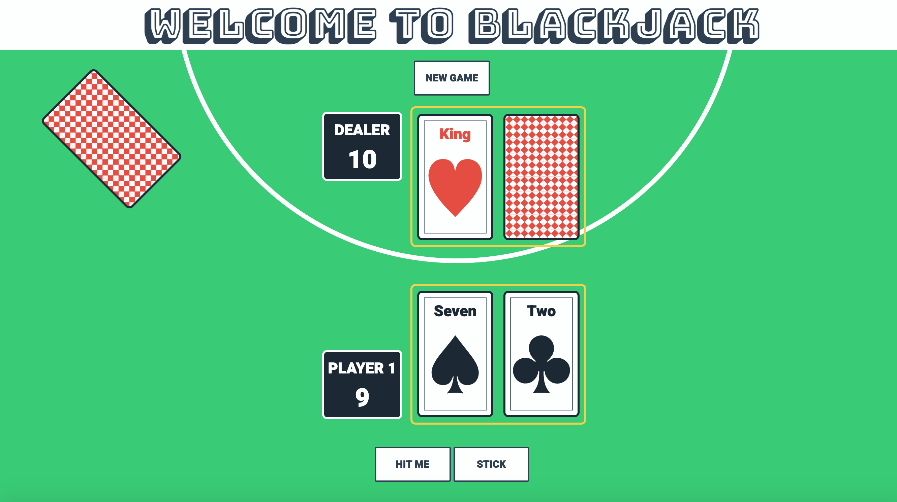

# BlackJack
Basic BlackJack game implemented in JavaScript. 

|  |
|:---:|

# Built With
- Vanilla JavaScript (ES6+)
- HTML
- CSS

# Demo
Game can be found [here](https://js-black-jack.netlify.app/)

# Roadmap
- Show cards face down (display dealer's second card)
- Animations for cards being dealt
- Add game feature to split cards

# Credits

Font Bungee Shade - https://fonts.google.com/specimen/Bungee+Shade#standard-styles

Font Heebo - https://fonts.google.com/specimen/Heebo
